# HTML File Link

::: callout-important
:::

# 1) CTEs (WITH) to structure logic

**What it does:** creates named “mini tables” inside a query.

### Total users + new users

```{sql}
-- Query 1: Total users + new users using a CTE
-- Create a temporary table called UserInfo
-- Identify whether each user is a new user
-- based on first_visit or first_open events
-- Count total users and total new users

WITH UserInfo AS (
SELECT
user_pseudo_id,
MAX(IF(event_name IN ('first_visit', 'first_open'), 1, 0)) AS is_new_user
FROM `bigquery-public-data.ga4_obfuscated_sample_ecommerce.events_*`
WHERE _TABLE_SUFFIX BETWEEN '20201101' AND '20201130'
GROUP BY user_pseudo_id
)
SELECT
COUNT(*) AS total_users,
SUM(is_new_user) AS new_users
FROM UserInfo;
```

::: {.callout-note appearance="minimal"}
This query uses a **CTE (WITH statement)** to create a temporary table called **UserInfo**. The CTE tells us if each user is a new user based on if they triggered a **first_visit** or **first_open** event. The final query counts the total number of users and the number of new users inNovember 2020.
:::


# 2) Arrays + UNNEST (the GA4 superpower)

GA4 stores lots of fields inside arrays:

-   `event_params` (key/value pairs)

-   `items` (products in commerce events)

**Two common patterns:**

### Pattern A — Scalar subquery extraction (simple, safe)

Pull one parameter from `event_params` without exploding rows.

```{sql}
-- Query 2A: Extract page_location from event_params
-- Convert event timestamps into readable format
-- Extract the page_location parameter
-- from the event_params array
-- Return page_view events only

SELECT
TIMESTAMP_MICROS(event_timestamp) AS event_time,
(
SELECT value.string_value
FROM UNNEST(event_params)
WHERE key = 'page_location' LIMIT 1
) AS page_location
FROM `bigquery-public-data.ga4_obfuscated_sample_ecommerce.events_*`
WHERE event_name = 'page_view'
AND _TABLE_SUFFIX BETWEEN '20201201' AND '20201202'
LIMIT 50;
```

::: {.callout-note appearance="minimal"}
This query extracts the **page_location** parameter from the **event_params** array without creating additional rows. The results show readable timestamps and the webpage URLs users visited during page view events.
:::

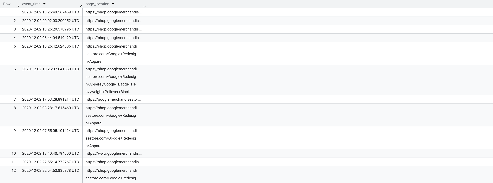

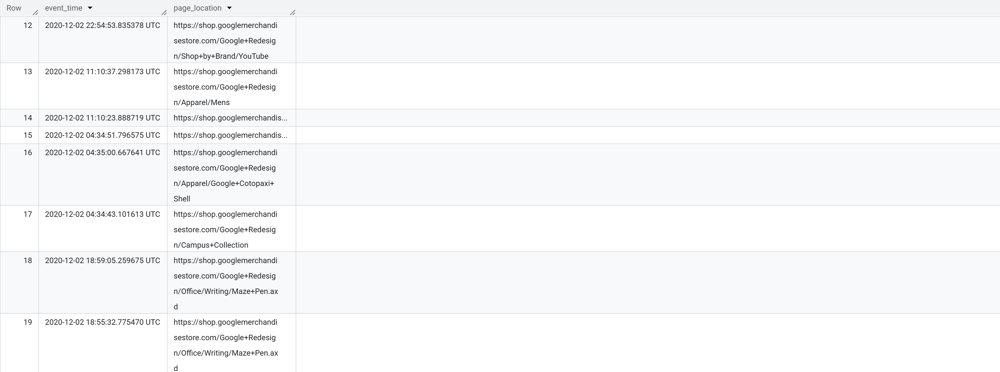

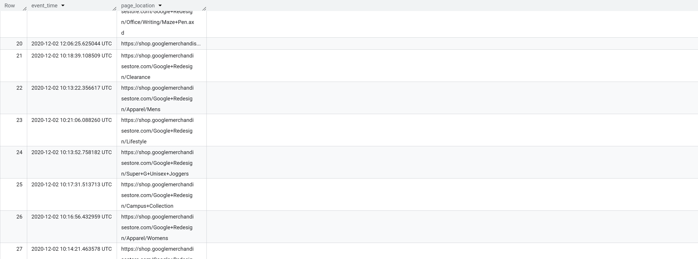

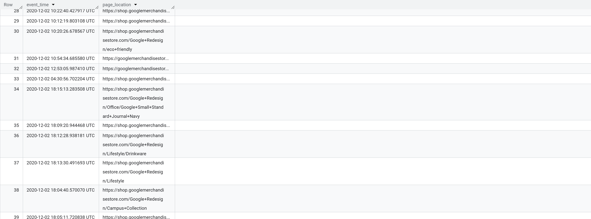

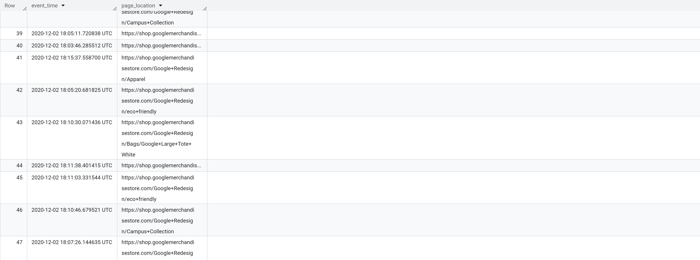

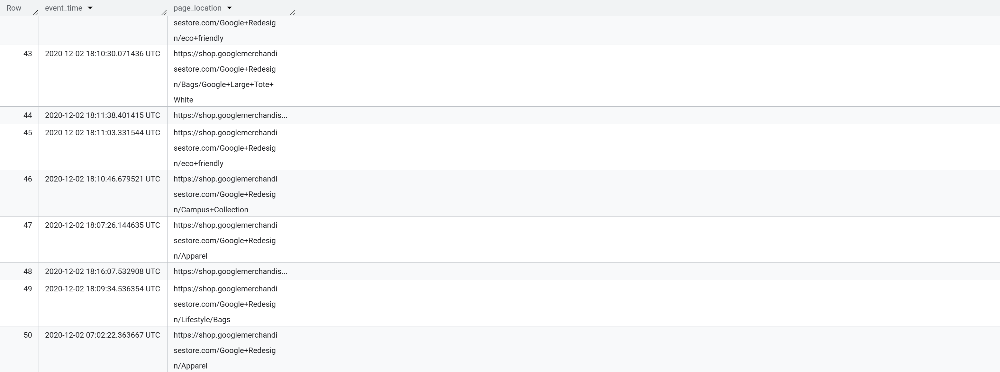

### Pattern B — Flattening (UNNEST in FROM) for item-level analysis

This *multiplies rows* (one event can have many items).

```{sql}
-- Query 2B: Analyze purchase items using UNNEST
-- Flatten the items array
-- Return one row per item
-- Count how often each item appeared in purchase

SELECT
event_date,
item.item_name,
COUNT(*) AS item_rows
FROM `bigquery-public-data.ga4_obfuscated_sample_ecommerce.events_*` e,
UNNEST(e.items) AS item
WHERE e.event_name = 'purchase'
AND _TABLE_SUFFIX BETWEEN '20201201' AND '20201231'
GROUP BY event_date, item.item_name
ORDER BY item_rows DESC
LIMIT 20;
```

::: callout-important
**Note:** UNNEST changes the “grain.” After unnesting `items`, you’re no longer at “event-level”; you’re at “item-row per event.”
:::

::: {.callout-note appearance="minimal"}
This query uses **UNNEST** to flatten the nested **items** array so that each purchased product has its own row. The results show the most frequently purchased items and how often they appeared in purchase events.
:::


# 3) STRING_AGG, ARRAY_AGG (useful aggregations)

**What they do:** combine many values into one row per group.

### Example: show a few event_names seen per day

```{sql}
-- Query 3A: Show event types seen each day
-- Group events by date
-- Combine event names 
-- Sort event names alphabetically

SELECT
event_date,
STRING_AGG(DISTINCT event_name, ', ' ORDER BY event_name) AS events_seen
FROM `bigquery-public-data.ga4_obfuscated_sample_ecommerce.events_*`
WHERE _TABLE_SUFFIX BETWEEN '20201201' AND '20201203'
GROUP BY event_date
ORDER BY event_date;
```

::: {.callout-note appearance="minimal"}
This query uses **STRING_AGG** to combine multiple event names into a single comma-separated list for each day. This helps summarize the types of user activity that occurred each date.
:::


### Example: Build a “session cart summary” (top items a user added to cart)

#### Use Case 1:

**-- Task**: Create a list of items per session

```{sql}
-- Query 3B: Create list of items added to cart
-- Flatten the items array
-- Group data by user
-- Store item names inside an array

SELECT
    user_pseudo_id,
    ARRAY_AGG(item_name) AS items_added_to_cart
FROM `bigquery-public-data.ga4_obfuscated_sample_ecommerce.events_*`,
UNNEST(items) AS item
WHERE event_name = 'add_to_cart'
AND _TABLE_SUFFIX BETWEEN '20201201' AND '20201231'
GROUP BY user_pseudo_id
ORDER BY user_pseudo_id
LIMIT 10;
```

::: {.callout-note appearance="minimal"}
This query uses **ARRAY_AGG** to create a list of products each user added to their cart. The results show one row per user with an array containing all item names added during the selected period.
:::

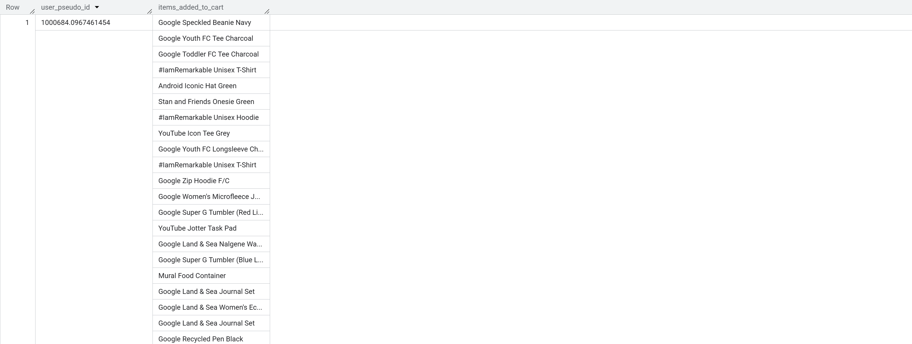

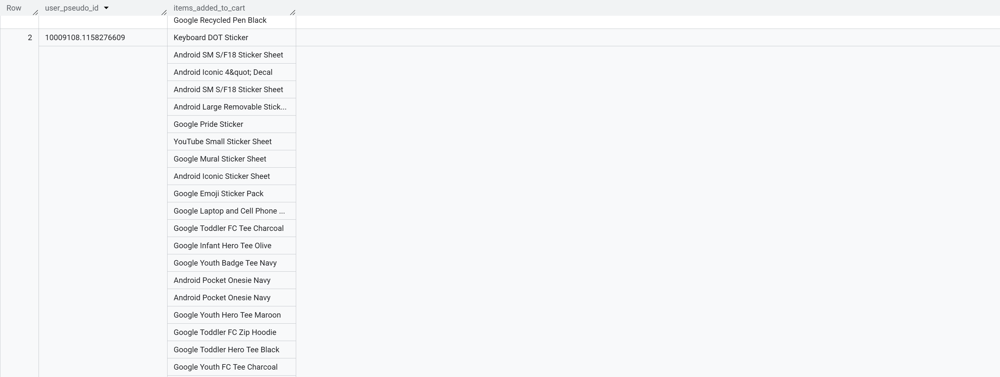

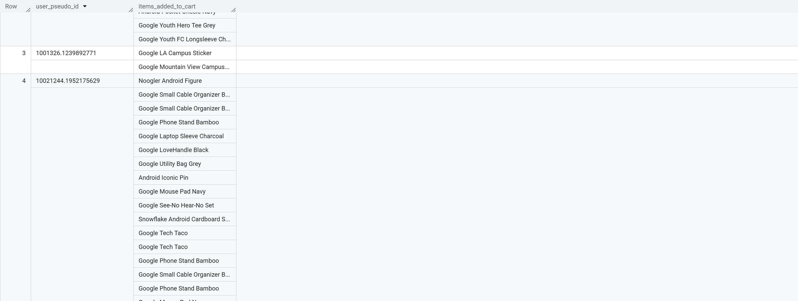

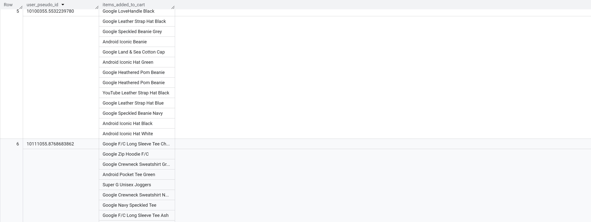

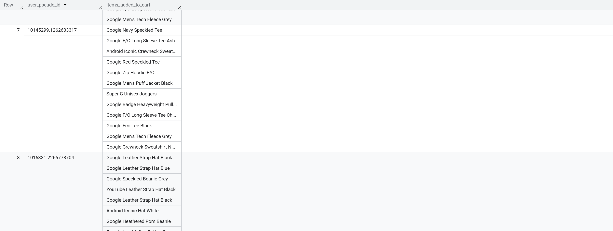

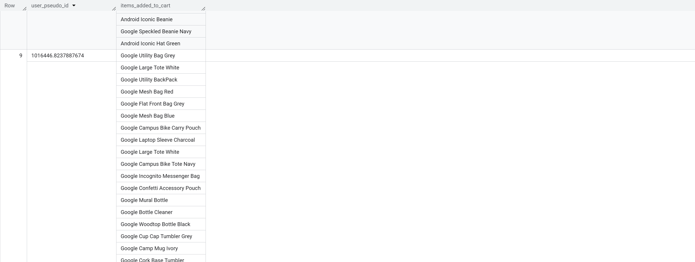

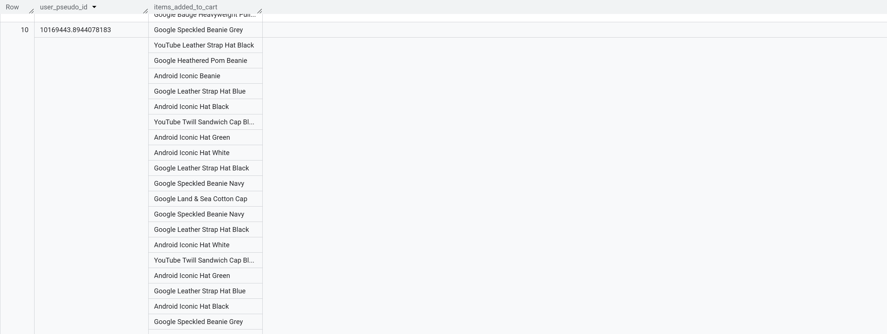

#### Use Case 2:

-- Session-level "cart summary" using ARRAY_AGG

```{sql}
-- Query 3C: Build a session-level cart summary
-- Create a CTE for add_to_cart events
-- Extract session ID from event_params
-- Flatten item data
-- Build an array of cart items per session

WITH add_to_cart AS (
  SELECT
    user_pseudo_id,
    (
      SELECT value.int_value 
      FROM UNNEST(event_params) 
      WHERE key = 'ga_session_id'
    ) AS session_id,
    TIMESTAMP_MICROS(event_timestamp) AS event_timestamp,
    i.item_id,
    i.item_name,
    i.quantity,
    i.price
  FROM `bigquery-public-data.ga4_obfuscated_sample_ecommerce.events_*`,
  UNNEST(items) AS i
  WHERE event_name = 'add_to_cart'
    AND _TABLE_SUFFIX BETWEEN '20210101' AND '20211231'  -- cost control
)
SELECT
  user_pseudo_id,
  session_id,
  COUNT(*) AS total_add_to_cart_events,              -- added insight
  ARRAY_AGG(
    STRUCT(item_id, item_name, quantity, price, event_timestamp)
    ORDER BY quantity DESC, event_timestamp ASC
    LIMIT 10
  ) AS cart_items
FROM add_to_cart
WHERE session_id IS NOT NULL                          --  filter nulls
GROUP BY user_pseudo_id, session_id;


```

::: {.callout-note appearance="minimal"}
This query creates a session-level shopping cart summary using **ARRAY_AGG** and **STRUCT**. The output shows each user session, the number of add-to-cart events, and a structured array containing the products added during the session.
:::


# 4) Joins (start with INNER and LEFT)

**What it does:** combines results based on matching keys.

### Example: daily users joined with daily purchases (using CTEs)

```{sql}
-- Query 4: Join daily users with daily purchases
-- Create a CTE for daily users
-- Create a CTE for daily purchases
-- Join both datasets by event_date
-- Calculate conversion rate

WITH daily_users AS (
  SELECT
    event_date,
    COUNT(DISTINCT user_pseudo_id) AS users
  FROM `bigquery-public-data.ga4_obfuscated_sample_ecommerce.events_*`
  WHERE _TABLE_SUFFIX BETWEEN '20201201' AND '20201231'
  GROUP BY event_date
),
daily_purchases AS (
  SELECT
    event_date,
    COUNT(DISTINCT
      (SELECT value.string_value
       FROM UNNEST(event_params)
       WHERE key = 'transaction_id')
    ) AS purchases    -- distinct transactions
  FROM `bigquery-public-data.ga4_obfuscated_sample_ecommerce.events_*`
  WHERE event_name = 'purchase'
    AND _TABLE_SUFFIX BETWEEN '20201201' AND '20201231'
  GROUP BY event_date
)
SELECT
  u.event_date,
  u.users,
  -- turns “no purchase row (NULL)” into 0 purchases, which is what you want for a daily time series
  IFNULL(p.purchases, 0) AS purchases,              
  -- Conversion rate: what % of daily users made a purchase
  ROUND(
    IFNULL(p.purchases, 0) / NULLIF(u.users, 0) * 100, 2
  ) AS conversion_rate_pct        -- NULLIF prevents division by zero
FROM daily_users u
LEFT JOIN daily_purchases p
  ON u.event_date = p.event_date
ORDER BY u.event_date;
```

::: {.callout-note appearance="minimal"}
This query uses a **LEFT JOIN** to combine daily user counts with daily purchase counts. The results show us the number of users, purchases, and conversion rate for each day during the time selected.
:::


# 5) Window functions + QUALIFY

**What they do:** calculate “across rows” without collapsing to one row per group.

### Top 3 event types per day (RANK) + QUALIFY

```{sql}
-- Query 5A: Find top 3 event types per day
-- Count events by date and event name
-- Rank event types within each day
-- Keep only the top 3 ranked events

WITH daily_event_counts AS (
SELECT
event_date,
event_name,
COUNT(*) AS events
FROM `bigquery-public-data.ga4_obfuscated_sample_ecommerce.events_*`
WHERE _TABLE_SUFFIX BETWEEN '20201201' AND '20201207'
GROUP BY event_date, event_name
)
SELECT
event_date,
event_name,
events,
RANK() OVER (PARTITION BY event_date ORDER BY events DESC) AS rnk
FROM daily_event_counts
QUALIFY rnk <= 3 
ORDER BY event_date, rnk;

```

::: {.callout-note appearance="minimal"}
This query uses the **RANK() window function** to rank event types by popularity each day. **QUALIFY** filters the results to show only the top three event types per date.
:::

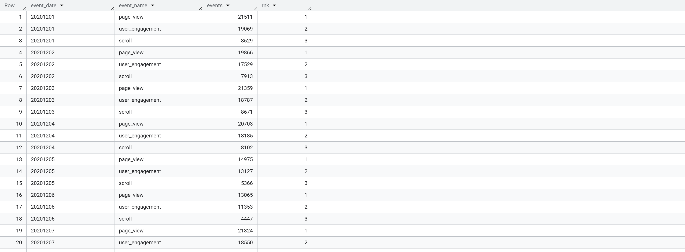

### Rolling 7-day average of daily purchases

```{sql}
-- Query 5B: Calculate rolling 7-day average of purchases
-- Count purchases per day
-- Use a window function to calculate
-- a moving 7-day average

WITH daily_purchases AS (
SELECT
PARSE_DATE('%Y%m%d', event_date) AS dt,
COUNT(*) AS purchases
FROM `bigquery-public-data.ga4_obfuscated_sample_ecommerce.events_*`
WHERE event_name = 'purchase'
AND _TABLE_SUFFIX BETWEEN '20201201' AND '20201231' GROUP BY dt
)
SELECT
dt,
purchases,
AVG(purchases) OVER (
ORDER BY dt
ROWS BETWEEN 6 PRECEDING AND CURRENT ROW
) AS purchases_7d_avg
FROM daily_purchases
ORDER BY dt;
```

::: {.callout-note appearance="minimal"}
This query calculates a rolling 7-day average of purchase activity using a window function. The results level fluctuations and help identify purchase trends.
:::


# 6) Approximate functions (performance-minded)

**What they do:** return “close enough” answers faster on huge datasets.

### Approx distinct users per event type

```{sql}
-- Query 6: Approximate distinct users by event type
-- Group events by event_name
-- Estimate distinct users using APPROX_COUNT_DISTINCT
-- Sort event types by estimated users

SELECT
event_name,
APPROX_COUNT_DISTINCT(user_pseudo_id) AS approx_users
FROM `bigquery-public-data.ga4_obfuscated_sample_ecommerce.events_*`
WHERE _TABLE_SUFFIX BETWEEN '20201201' AND '20201231'
GROUP BY event_name
ORDER BY approx_users DESC
LIMIT 15;
```

::: {.callout-note appearance="minimal"}
This query uses **APPROX_COUNT_DISTINCT** to estimate the number of unique users per each event type. Approximate functions can improve performance on large datasets but still produce accurate estimates.
:::

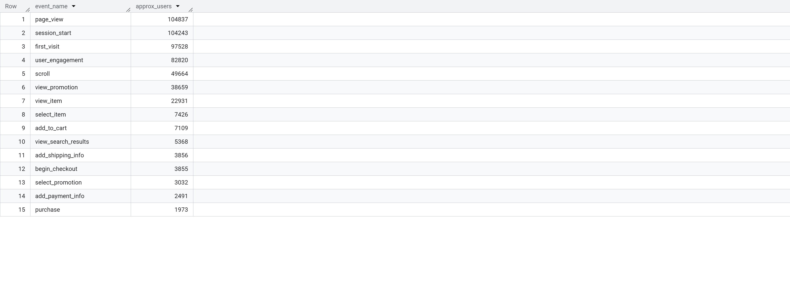
